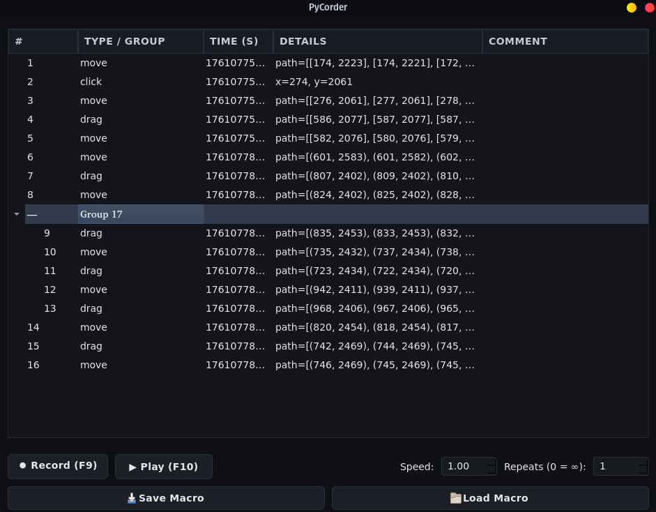

# PyCorder — Smart Macro Recorder & Player

**PyCorder** is a Python-based automation tool that lets you **record, edit, and replay** user interactions such as clicks, drags, and keyboard inputs.

---

## Features

- 🎥 **Record Actions** — Automatically capture mouse and keyboard input.  
- ▶️ **Playback System** — Replay recorded macros at custom speed or from any point.  
- 🎬 **Play Groups Only** — Run specific grouped actions independently when needed.  
- 🧩 **Group Actions** — Organize sequences into reusable logical groups.  
- 📋 **Copy & Paste** — Duplicate or reuse actions and groups easily.  
- ✍️ **Inline Editing** — Modify times, coordinates, and comments directly in the tree.  
- 💾 **Save & Load** — Export and import macros as `.json` files.  
- 🔍 **Live Overlay** — Visual feedback for mouse movements and clicks.

---

## Installation & Release

You can download ready-to-use binaries from the Releases section:  
[→ Go to Releases](https://github.com/cruv3/PyCorder/releases)

## LICENSE

This program is licensed under the [GNU General Public License v3.0](LICENSE).
